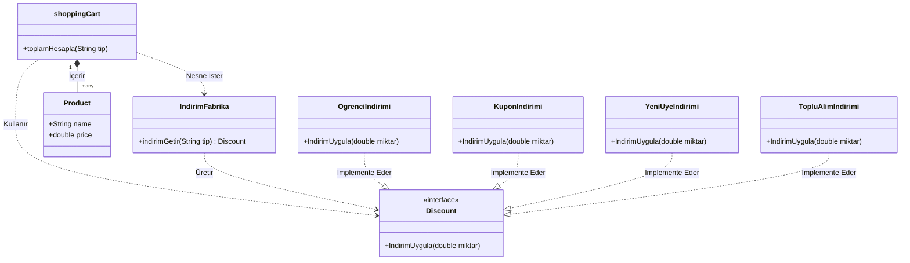
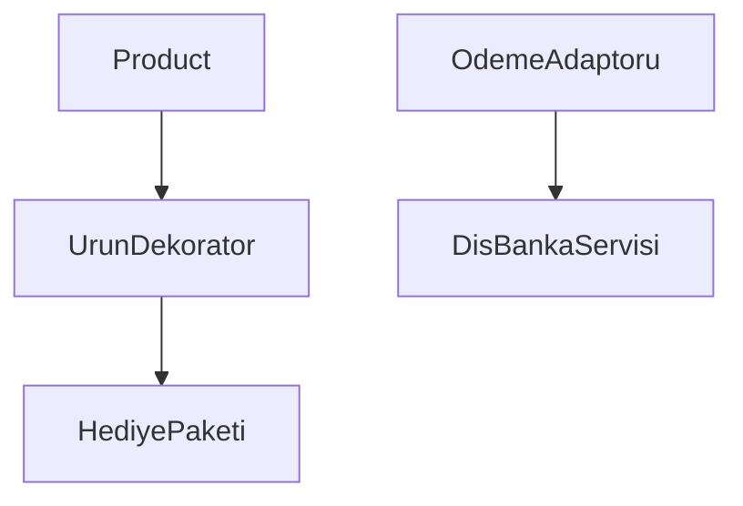

# FAZ1
# 1. Uygulanan Yer ve Problem
shoppingCart sınıfı içerisinde, farklı indirim stratejilerine göre nesne oluşturma işlemi if-else blokları ile manuel olarak yapılıyordu. Bu durum, sisteme yeni bir indirim türü eklendiğinde ana sınıfın değiştirilmesini zorunlu kılıyor ve kodun esnekliğini azaltıyordu.

# 2. Nereden, Neden ve Ne Kazandırdı?
•	Nerede: İndirim nesnelerinin (KuponIndirimi, OgrenciIndirimi vb.) üretim sürecinde.
•	Neden: Nesne yaratma sorumluluğunu (Creational responsibility) merkezileştirmek ve Open-Closed Principle prensibine uyum sağlamak için.
•	Kazanç: shoppingCart sınıfı artık somut indirim sınıflarına bağımlı değildir. Yeni bir indirim türü eklendiğinde mevcut kodları bozmadan sadece yeni bir class eklemek yeterli hale gelmiştir.

Önceki Durum (Faz 0)
•	Bağımlılık: shoppingCart sınıfı, tüm indirim hesaplama mantığına göbekten bağlıydı.
•	Kod Kalabalığı: Hesaplama metodu içinde upuzun if-else blokları bulunuyordu.
•	Geliştirme Zorluğu: Yeni bir indirim türü (örneğin "Yaz İndirimi") eklemek için ana sınıfın kodlarını manuel olarak değiştirmek ve sistemi bozma riskini göze almak gerekiyordu.
•	Sorumluluk: shoppingCart sınıfı hem ürünleri tutuyor hem de nesne yaratma işini üstleniyordu (Single Responsibility Principle ihlali).
Sonraki Durum (Faz 1): Factory Method ile Modüler Yapı
•	Bağımlılık: shoppingCart artık somut indirim sınıflarını (OgrenciIndirimi vb.) tanımıyor. Sadece Discount arayüzünü (interface) biliyor.
•	Kod Kalabalığı: Onlarca satırlık if-else bloğu silindi; yerine tek satırlık IndirimFabrika.indirimGetir(tip) çağrısı geldi.
•	Geliştirme Kolaylığı: Yeni bir indirim türü eklemek için mevcut hiçbir kodu değiştirmeye gerek yok. Sadece Discount arayüzünü kullanan yeni bir sınıf oluşturmak yeterli (Open-Closed Principle).
•	Sorumluluk: Nesne yaratma sorumluluğu tamamen IndirimFabrika sınıfına devredildi.

# Faz 2: Yapısal (Structural) Tasarım Örüntüleri

## 1. Adapter (Adaptör) Örüntüsü
**Sorun:** Sistemimize dahil edilen `DisBankaServisi` kütüphanesinin metod isimleri (`tahsilatGerceklestir`), bizim mevcut ödeme arayüzümüzle uyumlu değildi.
**Çözüm:** `OdemeAdaptoru` sınıfı oluşturularak bu dış servis sarmalandı.
**Sonuç:** Mevcut ödeme sistemimizdeki kodları değiştirmeden, yeni bir banka servisini sisteme entegre edebildik.

## 2. Decorator (Dekoratör) Örüntüsü
**Sorun:** Ürünlere (Product) çalışma anında dinamik olarak özellik (Hediye Paketi, Garanti vb.) eklemek istiyorduk ama ana sınıfları (`Elektronik`, `Kitap`) her yeni özellik için kalıtımla çoğaltmak "Class Explosion" (Sınıf Patlaması) riskine yol açıyordu.
**Çözüm:** `UrunDekorator` abstract sınıfı ve ondan türeyen `HediyePaketi` somut dekoratörü oluşturuldu.
**Sonuç:** `Product` nesnesinin davranışını, mevcut nesne yapısını bozmadan genişlettik. Open-Closed prensibi uygulandı.

